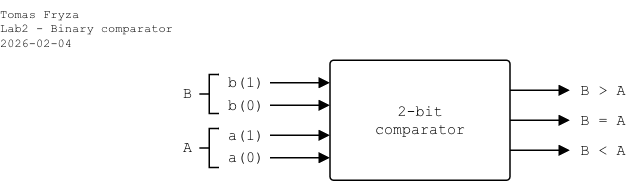

# Laboratory 2: Binary comparator

* [Task 1: Logic function minimization](#task1)
* [Task 2: 2-bit binary comparator](#task2)
* [Task 3: Assertion statements](#task3)
* [Optional tasks](#tasks)
* [Questions](#questions)
* [References](#references)

### Objectives

After completing this laboratory, students will be able to:

* Use truth table, K-map, SoP/PoS forms of logic functions
* Work with multi-bit signals
* Use relational operators (`>`, `<`, `=`)
* Use VHDL assertion statements for testing

### Background

*[Karnaugh Maps](https://learnabout-electronics.org/Digital/dig24.php) (or K-maps)* offer a graphical method of reducing a digital circuit to its minimum number of gates. The map is a simple table containing `1`s and `0`s that can express a truth table or complex Boolean expression describing the operation of a digital circuit.

*Digital* or *Binary comparator* compares the digital signals A, B presented at input terminal and produce outputs depending upon the condition of those inputs.

   

<a name="task1"></a>

## Task 1: Logic function minimization

1. Complete the truth table for 2-bit *Identity comparator* (B equals A), and two *Magnitude comparators* (B is greater than A, A is greater than B). Note that, such a digital device has four inputs and three outputs/functions but only **one output** should be HIGH at a time:

   - `b_gt`: Output is `1` when `b > a`
   - `b_a_eq`: Output is `1` when `b = a`
   - `a_gt`: Output is `1` when `b < a`

      | **Dec. equivalent** | **B(1:0)** | **A(1:0)** | **B is greater than A** | **B equals A** | **A is greater than B** |
      | :-: | :-: | :-: | :-: | :-: | :-: |
      |  0 | 0 0 | 0 0 | 0 | 1 | 0 |
      |  1 | 0 0 | 0 1 | 0 | 0 | 1 |
      |  2 | 0 0 | 1 0 | 0 | 0 | 1 |
      |  3 | 0 0 | 1 1 | 0 | 0 | 1 |
      |  4 | 0 1 | 0 0 |  | 0 |  |
      |  5 | 0 1 | 0 1 |  | 1 |  |
      |  6 | 0 1 | 1 0 |  | 0 |  |
      |  7 | 0 1 | 1 1 |  | 0 |  |
      |  8 | 1 0 | 0 0 |  | 0 |  |
      |  9 | 1 0 | 0 1 |  | 0 |  |
      | 10 | 1 0 | 1 0 |  | 1 |  |
      | 11 | 1 0 | 1 1 |  | 0 |  |
      | 12 | 1 1 | 0 0 |  | 0 |  |
      | 13 | 1 1 | 0 1 |  | 0 |  |
      | 14 | 1 1 | 1 0 |  | 0 |  |
      | 15 | 1 1 | 1 1 |  | 1 |  |

2. According to truth table, complete K-maps for all functions.

   

3. Use K-maps to create simplified SoP and PoS forms of "B greater than A" function.

<a name="task2"></a>

## Task 2: 2-bit binary comparator

Design a circuit that implements a **2-bit binary comparator**. The comparator shall compare two 2-bit unsigned inputs `a` and `b` and generate three mutually exclusive outputs `b_gt`, `b_a_eq`, `a_gt`.

   <!--
   | **Port name** | **Direction** | **Type** | **Description** |
   | :-: | :-: | :-- | :-- |
   | `b`       | input  | [`std_logic_vector(1 downto 0)`](https://github.com/tomas-fryza/vhdl-examples/wiki/Data-types) | Input bus b[1:0] |
   | `a`       | input  | `std_logic_vector(1 downto 0)` | Input bus a[1:0] |
   | `b_gt` | output | `std_logic` | Output is `1` if b > a |
   | `b_a_eq` | output | `std_logic` | Output is `1` if b = a |
   | `a_gt` | output | `std_logic` | Output is `1` if b < a |
   -->

   - Use 2-bit input busses [`std_logic_vector(1 downto 0)`](https://github.com/tomas-fryza/vhdl-examples/wiki/Data-types)
   - Use **combinational logic only**
   - Use **concurrent signal assignments** (`<=`)
   - Do not use clocks or sequential logic
   - The design must be synthesizable
   - Only **one output may be HIGH at a time** (one-hot behavior)
   - All 16 input combinations must be verified by simulation

1. Run Vivado and create a new project:

   1. Project name: `comparator`
   2. Project location: your working folder, such as `Documents`
   3. Project type: **RTL Project**
   4. Create a new VHDL source file: `comparator`
   5. Do not add any constraints now
   6. Choose a default board: `Nexys A7-50T`
   7. Click **Finish** to create the project
   8. Define I/O ports of new module:

      * Port name: `a`, Direction: `in`, Bus: `check`, MSB: `1`, LSB: `0`
      * `b`, `in`, Bus: `check`, MSB: `1`, LSB: `0`
      * `b_gt`, `out`
      * `b_a_eq`, `out`
      * `a_gt`, `out`

2. In VHDL, define an [architecture](https://github.com/tomas-fryza/vhdl-examples/wiki/Architecture) for a 2-bit binary comparator. The combination logic can be written using low-level operators (`and`, `or`, etc.) as assignment statements using SoP or PoS logic. However, it is more efficient to use a higher notation with [conditional signal assignments](https://github.com/tomas-fryza/vhdl-examples/wiki/Signal-assignments).

   ```vhdl
   -------------------------------------------------
   -- Architecture definition, Implementation design
   -------------------------------------------------
   architecture behavioral of comparator is
   begin
     ---------------------------------------------
     -- Method 1: Behavioral (recommended for design)
     ---------------------------------------------
     b_gt   <= '1' when (b > a) else
               '0';
     b_a_eq <= '1' when (b = a) else
               '0';
     a_gt   <= '1' when (b < a) else
               '0';

     ---------------------------------------------
     -- Method 2: Gate-level implementation (for learning only)
     -- This logic is derived from the truth table for
     -- a 2-bit magnitude comparator.
     ---------------------------------------------

   end architecture behavioral;
   ```

3. Use **File > Add Sources... Alt+A > Add or create simulation sources** and create a new VHDL file `comparator_tb`. [Generate the testbench](https://vhdl.lapinoo.net/testbench/) file, and complete the stimuli process by all input combinations.

   ```vhdl
   stimuli : process
   begin
     b <= "00"; a <= "00"; wait for 10 ns;


     -- TODO: Write other test cases here


     wait;
   end process;
   ```

4. In `architecture`, use method 2 and implement `b_gt` using minimized Boolean equation in SoP or PoS logic at gate-level. Simulate it. Compare waveform results with behavioral version.

   > **Note:** The behavioral implementation is synthesizable and preferred in real designs because it is clearer, scalable, and less error-prone than manual Boolean equations.

<a name="task3"></a>

## Task 3: Assertion statements

Relying only on waveform inspection is not sufficient. Modern digital design requires **self-checking verification**, where the testbench evaluates whether the Design Under Test (DUT) behaves as expected. There are three levels of testing quality:

   * **Manual checking** (bad). Inputs are applied and the waveform is visually inspected.

   * **Hardcoded expected values** (better). Expected outputs are manually written for each test case.

   * **Computed expected model** (best). The testbench computes expected results automatically and compares them with DUT outputs.

During the simulation, you can write any information to the console using the **report statement**. The basic syntax in VHDL is:

   ```vhdl
   report <message_string> [severity <severity_level>];
   ```

where possible values for `severity_level` are: `note`, `warning`, `error`, `failure`. If the severity level is omitted, then the default value is `note`. The following two statements are therefore equivalent:

   ```vhdl
   report "Stimulus process started" severity note;
   report "Stimulus process started";
   ```

Assertions are part of verification methodology and allow automated checking of correctness during simulation. An **assertion statement** checks that a specified condition is true and **reports an error if it is not**. It can be combined with a report statement as follows:

   ```vhdl
   assert <condition>
     report <message_string> [severity <severity_level>];
   ```

Remember, the message is displayed to the console when the condition is NOT met, therefore the message should be an opposite to the condition.

   ```vhdl
   p_stimulus : process is
   begin

     report "Stimulus process started";

     -- Test case is followed by the expected output value(s). If assert
     -- condition is false, then an error is reported to the console.

     b <= "00"; a <= "00"; wait for 10 ns;

     assert (b_gt = '0') and (b_a_eq = '1') and (a_gt = '0')
       report "[ERROR] Unexpected result" severity error;


     -- TODO: Write other test cases and asserts here


     report "Stimulus process finished";

     -- Data generation process is suspended forever
     wait;

   end process p_stimulus;
   ```

1. In VHDL, extend your testbench, and use assertions for each case. The simulation is considered successful if no assertion reports severity error or failure.

2. Use **Flow > Open Elaborated design** and see the schematic after RTL analysis.

<a name="tasks"></a>

## Optional tasks

1. Use conditional signal assignments `when/else` and extend comparator to 4-bit (scalability).

2. Design a [*Prime number detector*](https://link.springer.com/chapter/10.1007/978-3-030-10552-5_1) that takes in values from 0 to 15.

   

<a name="questions"></a>

## Questions

1. What is the advantage of using K-maps instead of directly writing SoP expressions?

2. Why is using relational operators preferred over manual Boolean equations?

3. Why must only one comparator output be high at a time?

4. How many input combinations must be tested for a 2-bit comparator?

5. Why are assertions important in digital design? What is the difference between `error` and `failure` severity?

<a name="references"></a>

## References

1. Eric Coates. [Karnaugh Maps](https://learnabout-electronics.org/Digital/dig24.php)

2. Tomas Fryza. [Example of 2-bit binary comparator using the when/else assignments](https://www.edaplayground.com/x/5uu3)

3. Digilent Reference. [Nexys A7 Reference Manual](https://digilent.com/reference/programmable-logic/nexys-a7/reference-manual)

4. Brock J. LaMeres. [The Modern Digital Design Flow](https://link.springer.com/chapter/10.1007/978-3-030-10552-5_1)

5. DesignSpark. [Implement a simple digital circuit through FPGA trainer board and in Xilinx Vivado IDE (VHDL)](https://www.rs-online.com/designspark/lab1-vhdl)
