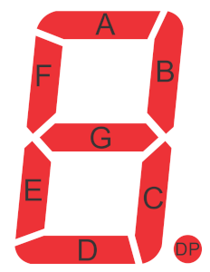
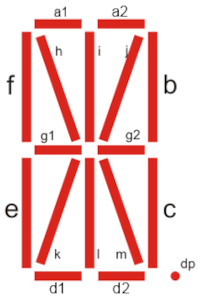
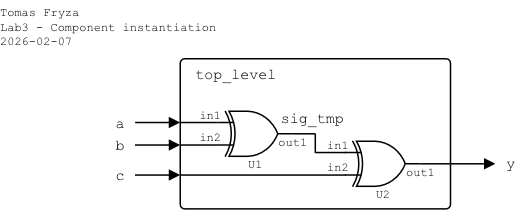
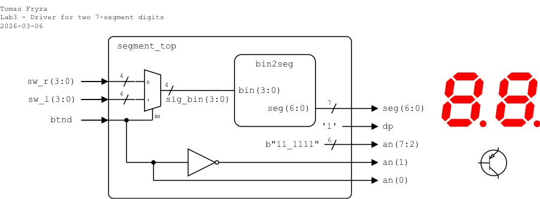

# Laboratory 3: Seven-segment display decoder

* [Task 1: Seven-segment display decoder](#task1)
* [Task 2: Structural modeling and instantiation](#task2)
* [Task 3: Top-level design and FPGA implementation](#task3)
* [Optional tasks](#tasks)
* [Questions](#questions)
* [References](#references)

### Objectives

After completing this laboratory, students will be able to:

* Use 7-segment display
* Use VHDL processes
* Understand the structural modeling and instantiation in VHDL
* Implement design to real hardware

### Background

The Binary to 7-Segment Decoder converts 4-bit binary data to 7-bit control signals which can be displayed on 7-segment display. A display consists of 7 LED segments to display the decimal digits `0` to `9` and letters `A` to `F`.

Note that, there are other types of segment displays, such as 9-, 14- or 16-segment.

    &nbsp; &nbsp; &nbsp; &nbsp;
    &nbsp; &nbsp; &nbsp; &nbsp;
    &nbsp; &nbsp; &nbsp; &nbsp;
   

The Nexys A7 board provides two four-digit common anode seven-segment LED displays (configured to behave like a single eight-digit display). See [schematic](https://github.com/tomas-fryza/vhdl-examples/blob/master/docs/nexys-a7-sch.pdf) or [reference manual](https://reference.digilentinc.com/reference/programmable-logic/nexys-a7/reference-manual) of the Nexys A7 board and find out the connection of 7-segment displays and push-buttons. What is the difference between NPN and PNP type of BJT (Bipolar Junction Transistor).

   

<a name="task1"></a>

## Task 1: Seven-segment display decoder

1. Complete the decoder truth table for a **common anode** (active low) 7-segment display.

   

   | **Symbol** | **bin** | **a** | **b** | **c** | **d** | **e** | **f** | **g** |
   | :-: | :-: | :-: | :-: | :-: | :-: | :-: | :-: | :-: |
   | `0` | 0000 | 0 | 0 | 0 | 0 | 0 | 0 | 1 |
   | `1` | 0001 | 1 | 0 | 0 | 1 | 1 | 1 | 1 |
   | `2` |      |   |   |   |   |   |   |   |
   | `3` |      |   |   |   |   |   |   |   |
   | `4` |      |   |   |   |   |   |   |   |
   | `5` |      |   |   |   |   |   |   |   |
   | `6` |      |   |   |   |   |   |   |   |
   | `7` | 0111 | 0 | 0 | 0 | 1 | 1 | 1 | 1 |
   | `8` | 1000 | 0 | 0 | 0 | 0 | 0 | 0 | 0 |
   | `9` |      |   |   |   |   |   |   |   |
   | `A` |      |   |   |   |   |   |   |   |
   | `b` |      |   |   |   |   |   |   |   |
   | `C` |      |   |   |   |   |   |   |   |
   | `d` |      |   |   |   |   |   |   |   |
   | `E` | 1110 | 0 | 1 | 1 | 0 | 0 | 0 | 0 |
   | `F` | 1111 | 0 | 1 | 1 | 1 | 0 | 0 | 0 |

2. Run Vivado, create a new RTL project named `segment` with a VHDL source file `bin2seg`. Use the following I/O ports:

   | **Port name** | **Direction** | **Type** | **Description** |
   | :-: | :-: | :-- | :-- |
   | `bin` | in | `std_logic_vector(3 downto 0)` | 4-bit hexadecimal input |
   | `seg` | out | `std_logic_vector(6 downto 0)` | {a,b,c,d,e,f,g} active-low outputs |

3. Use a [combinational process](https://github.com/tomas-fryza/vhdl-examples/wiki/Processes) to describe the decoder behavior.

   A process in VHDL is similar to a block in classical programming languages: statements inside the process are executed sequentially. However, the process itself runs concurrently with other processes in the architecture.

   General structure:

      ```vhdl
      process_label : process (sensitivity_list) is
          -- Declarative part (optional)
      begin
          -- Sequential statements
      end process process_label;
      ```

   All signals that affect the output must be listed in the **sensitivity list**. If a VHDL process has no sensitivity list and no `wait` statement, then: it executes all sequential statements, and when it reaches the end process, it automatically restarts immediately!

   For a combinational decoder, the process should be sensitive to `bin` only. Inside the process, use a `case`-`when` [assignments](https://github.com/tomas-fryza/vhdl-examples/wiki/Signal-assignments) to describe the mapping between the input value and the 7-segment output.

      ```vhdl
      -- This combinational process decodes binary input
      -- `bin` into 7-segment display output `seg` for a
      -- Common Anode configuration (active-low outputs).
      -- The process is triggered whenever `bin` changes.

      p_7seg_decoder : process (bin) is
      begin
          case bin is
              when x"0" =>
                  seg <= "0000001";
              when x"1" =>
                  seg <= "1001111";

              -- TODO: Complete settings for 2, 3, 4, 5, 6

              when x"7" =>
                  seg <= "0001111";
              when x"8" =>
                  seg <= "0000000";

              -- TODO: Complete settings for 9, A, b, C, d

              when x"E" =>
                  seg <= "0110000";

              -- Default case (e.g., for undefined values)
              when others =>
                  seg <= "0111000";
          end case;
      end process p_7seg_decoder;
      ```

4. Create a VHDL simulation source file named `bin2seg_tb`. [Generate a testbench template](https://vhdl.lapinoo.net/testbench/) and complete all test cases to verify the functionality of your decoder.

   Test cases can also be generated automatically using a loop. **Important:** You must include the `ieee.numeric_std.all` package to use the `to_unsigned` conversion function.

   Example:

      ```vhdl
      library ieee;
      use ieee.std_logic_1164.all;
      use ieee.numeric_std.all;  -- Required for "to_unsigned"
   
      ...

      -- Loop through all hexadecimal values (0 to 15)
      for i in 0 to 15 loop
   
          -- Convert integer i to 4-bit std_logic_vector
          bin <= std_logic_vector(to_unsigned(i, 4));
          wait for 10 ns;
   
      end loop;
      ```

5. Use **Flow > Open Elaborated design** and see the schematic after RTL analysis. Note that RTL (Register Transfer Level) represents digital circuit at the abstract level.

<a name="task2"></a>

## Task 2: Structural modeling and instantiation

VHDL allows designers to build larger digital systems from smaller, reusable components. This design approach is called [**structural modeling**](https://surf-vhdl.com/vhdl-syntax-web-course-surf-vhdl/vhdl-structural-modeling-style/), based on **instantiation**.

An instantiation statement creates an instance (a copy) of an existing design entity inside another design. In this way, complex systems can be constructed hierarchically from simpler building blocks.

Since VHDL-93, there are two main methods of instantiation:

   * **Direct instantiation** – The entity is instantiated directly inside the architecture of the parent design.

   * **Component instantiation** – A component is first declared in the architecture, and then instantiated. In both cases, signals are connected using the `port map` statement.

The following example shows a simple structural design consisting of two 2-input XOR gates. The top-level entity connects two instances (`U1` and `U2`) of the `xor2` component.

   

   ```vhdl
   architecture behavioral of top_level is

       -- Component declaration
       component xor2 is
            port (
                in1  : in  std_logic;
                in2  : in  std_logic;
                out1 : out std_logic
            );
       end component;

       -- Internal signal
       signal sig_tmp : std_logic;

   begin

       -- First XOR instance
       U1 : xor2
           port map (
               in1  => a,
               in2  => b,
               out1 => sig_tmp
           );

       -- Second XOR instance
       U2 : xor2
           port map (
               in1  => sig_tmp,
               in2  => c,
               out1 => y
           );

   end architecture behavioral;
   ```

In this example, `U1` and `U2` are two independent instances of the same component, the signal `sig_tmp` connects the output of the first XOR gate to the input of the second, and the architecture describes a structural netlist rather than behavioral logic.

<a name="task3"></a>

## Task 3: Top-level design and FPGA implementation

In this task, you will integrate your `bin2seg` decoder into a **top-level entity** and implement the design on the **Nexys A7 FPGA board**. The 4-bit input value will be provided by slide switches, and the decoded output will drive one digit of the onboard 7-segment display.

1. Create a new VHDL design source named `segment_top` in your project.
2. Define the following I/O ports:

   | **Port name** | **Direction** | **Type** | **Description** |
   | :-: | :-: | :-- | :-- |
   | `sw`  | in | `std_logic_vector(3 downto 0)` | Slide switches SW3..SW0 |
   | `seg` | out | `std_logic_vector(6 downto 0)` | Seven-segment cathodes CA..CG (active-low) |
   | `dp` | out | `std_logic` | Seven-segment decimal point (active-low, not used) |
   | `an` | out | `std_logic_vector(7 downto 0)` | Seven-segment anodes AN7..AN0 (active-low) |

3. Use component instantiation to connect `bin2seg` and define the top-level architecture.

   

   > **Note:** In Vivado, individual templates can be found in **Flow Navigator** or in the menu **Tools > Language Templates**. Search for `component declaration` and `component instantiation`.

   ```vhdl
   architecture behavioral of segment_top is

       -- Declare component `bin2seg`
       component bin2seg is
           port (
               bin : in  std_logic_vector(3 downto 0);
               seg : out std_logic_vector(6 downto 0)
           );
       end component;

   begin

       -- Instantiate decoder
       display : bin2seg
           port map (
               bin => sw,
               seg => seg
           );

       -- Turn off decimal point (inactive = '1')
       dp <= ...

       -- Enable only the rightmost digit (AN0 active-low)
       an <= ...

   end architecture behavioral;
   ```

   Only one digit must be enabled. All other digits must remain disabled to prevent multiple digits from lighting simultaneously.

4. A **constraint** is a rule that dictates a placement or timing restriction for the implementation. Constraints are not VHDL, and the syntax of constraints files differ between FPGA vendors.

   * __Physical constraints__ limit the placement of a signal or instance within the FPGA. The most common physical constraints are pin assignments. They tell the P&R (Place & Route) tool to which physical FPGA pins the top-level entity signals shall be mapped.

   * __Timing constraints__ set boundaries for the propagation time from one logic element to another. The most common timing constraint is the clock constraint. We need to specify the clock frequency so that the P&R tool knows how much time it has to work with between clock edges.

   In this design, only physical constraints are required.

5. Create a new constraints file `nexys` (XDC file).

6. Copy relevant pin assignments from the [Nexys A7-50T](../examples/_solutions/nexys.xdc) constraint file or use the following minimal constrains:

   ```xdc
   set_property PACKAGE_PIN J15 [get_ports {sw[0]}]
   set_property PACKAGE_PIN L16 [get_ports {sw[1]}]
   set_property PACKAGE_PIN M13 [get_ports {sw[2]}]
   set_property PACKAGE_PIN R15 [get_ports {sw[3]}]
   set_property IOSTANDARD LVCMOS33 [get_ports {sw[*]}]

   set_property PACKAGE_PIN T10 [get_ports {seg[6]}] ; # CA
   set_property PACKAGE_PIN R10 [get_ports {seg[5]}] ; # CB
   set_property PACKAGE_PIN K16 [get_ports {seg[4]}] ; # CC
   set_property PACKAGE_PIN K13 [get_ports {seg[3]}] ; # CD
   set_property PACKAGE_PIN P15 [get_ports {seg[2]}] ; # CE
   set_property PACKAGE_PIN T11 [get_ports {seg[1]}] ; # CF
   set_property PACKAGE_PIN L18 [get_ports {seg[0]}] ; # CG
   set_property PACKAGE_PIN H15 [get_ports {dp}]
   set_property IOSTANDARD LVCMOS33 [get_ports {seg[*] dp}]

   set_property PACKAGE_PIN J17 [get_ports {an[0]}]
   set_property PACKAGE_PIN J18 [get_ports {an[1]}]
   set_property PACKAGE_PIN T9  [get_ports {an[2]}]
   set_property PACKAGE_PIN J14 [get_ports {an[3]}]
   set_property PACKAGE_PIN P14 [get_ports {an[4]}]
   set_property PACKAGE_PIN T14 [get_ports {an[5]}]
   set_property PACKAGE_PIN K2  [get_ports {an[6]}]
   set_property PACKAGE_PIN U13 [get_ports {an[7]}]
   set_property IOSTANDARD LVCMOS33 [get_ports {an[*]}]
   ```

7. Implement your design to Nexys A7 board:

   1. Click **Generate Bitstream** (the process is time consuming and may take some time).
   2. Open **Hardware Manager**.
   3. Select **Open Target > Auto Connect** (make sure Nexys A7 board is connected and switched on).
   4. Click **Program device** and select the generated file `YOUR-PROJECT-FOLDER/segment.runs/impl_1/segment_top.bit`.

8. Test the functionality of the seven-segment display decoder by toggling the switches and observing the display.

9. Use **IMPLEMENTATION > Open Implemented Design > Schematic** to see the generated structure.

<a name="tasks"></a>

## Optional tasks

1. Display input `bin` value on LEDs.

2. Use 8 slide switches to extend the one-digit 7-segment decoder to drive a two-digit display. When the button `btnd` is pressed, the display should switch between the two digits and only one digit should be active at a time.

   

   ```vhdl
   architecture behavioral of segment_top is
       ...

       -- Internal signal for selected 4-bit input
       signal sig_tmp : std_logic_vector(3 downto 0);

   begin
       ...

       -- Select left or right 4-bit input (multiplexor)
       sig_tmp <= sw_l when (btnd = '1') else
                  sw_r;

       -- Disable unused digits (active-low logic)
       an(7 downto 2) <= b"11_1111";

       -- Enable only one digit at a time
       an(1) <= ...  -- left digit
       an(0) <= ...  -- right digit

   end architecture behavioral;
   ```

<a name="questions"></a>

## Questions

1. What is the difference between a common anode and a common cathode 7-segment display?

2. What would happen if the `bin` signal were not included in the process sensitivity list?

3. What is the purpose of the `when others` branch in the `case` statement?

4. What is the purpose of a top-level entity in an FPGA design?

5. What does instantiation mean in VHDL?

6. What is the purpose of the `port map` statement?

6. Why must only one digit (`an`) be enabled at a time on the Nexys A7 display?

<a name="references"></a>

## References

1. Digilent Reference. [Nexys A7 Reference Manual](https://digilent.com/reference/programmable-logic/nexys-a7/reference-manual)

2. LastMinuteEngineers. [How Seven Segment Display Works & Interface it with Arduino](https://lastminuteengineers.com/seven-segment-arduino-tutorial/)

3. Tomas Fryza. [Template for 7-segment display decoder](https://www.edaplayground.com/x/Vdpu)

4. Digilent. [General .xdc file for the Nexys A7-50T](https://github.com/Digilent/digilent-xdc/blob/master/Nexys-A7-50T-Master.xdc)

5. [LCD/LED Screenshot generator](http://avtanski.net/projects/lcd/)
