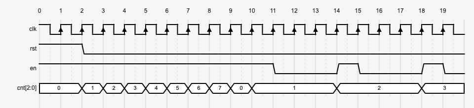
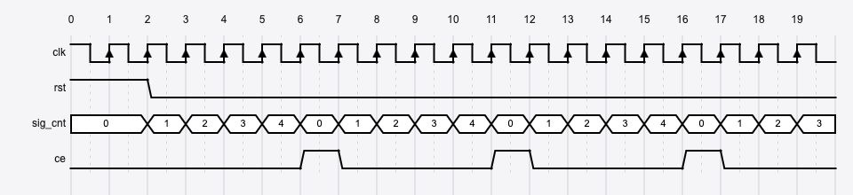
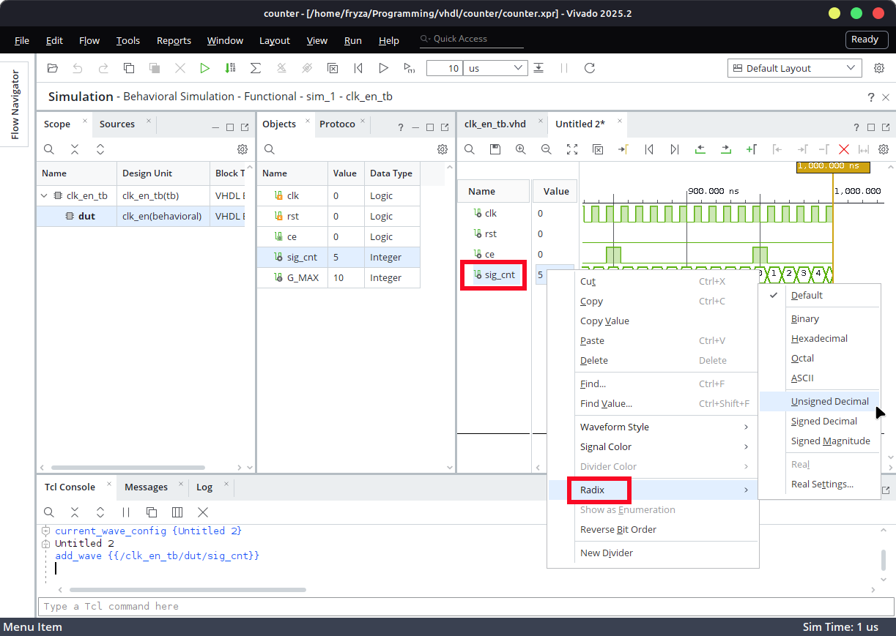
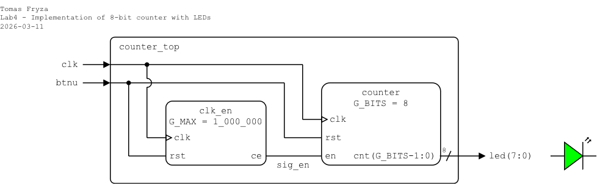
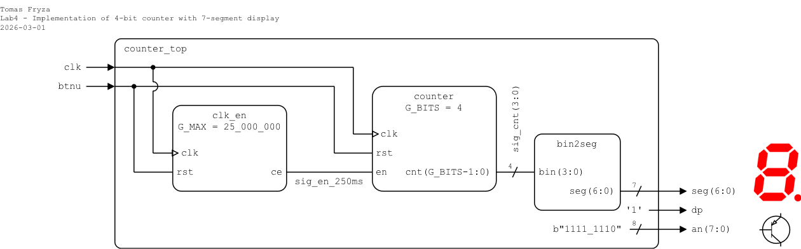
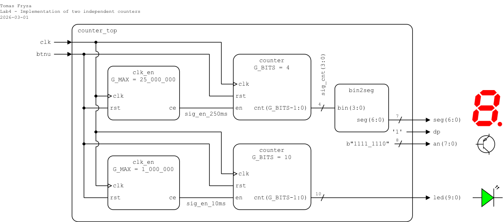

# Laboratory 4: Binary counter

* [Task 1: Clock enable](#task1)
* [Task 2: Binary counter](#task2)
* [Task 3: Top-level design and FPGA implementation](#task3)
* [Optional tasks](#tasks)
* [Questions](#questions)
* [References](#references)

### Objectives

After completing this laboratory, students will be able to:

* Understand binary counters
* Use VHDL generics and synchronous processes
* Use clock enable signal to drive another logic in the design (with slower clock)

### Background

A binary **N-bit counter** is a digital circuit with **N output bits** representing the current count value. It counts sequentially from `0` to `2^N-1` and then wraps around back to `0`. When the reset signal is asserted, the counter is cleared and starts again from `0`.

Many digital circuits include an **enable** (clock enable) input. This signal controls whether the counter is allowed to increment. When the clock enable signal is active (typically high), the counter updates its value on each clock edge and counts normally. When the clock enable signal is inactive (typically low), the counter holds its current value and does not increment.



<a name="task1"></a>

## Task 1: Clock enable

To drive other logic in the design that requires a slower operation, it is better to generate a **clock enable signal** (see figure bellow) instead of creating a new clock domain using clock dividers. Creating additional clock domains may cause timing issues or clock domain crossing (CDC) problems such as metastability, data loss, and data incoherency.



1. Calculate how many clock cycles of a 100&nbsp;MHz clock (period 10&nbsp;ns) correspond to the following time intervals: 2&nbsp;ms, 4&nbsp;ms, 8&nbsp;ms, 10&nbsp;ms, 250&nbsp;ms, 500&nbsp;ms, and 1&nbsp;s.

   Express each result in decimal, binary, and hexadecimal forms. What is the minimum number of bits required for each counter?

<!--
   &nbsp;
   
   &nbsp;

   
   &nbsp;

https://editor.codecogs.com/
T_{clk}=\frac{1}{f_{clk}}=
\textup{number of clk period} = \frac{\textup{time interval}}{T_{clk}}=
-->

   | **Time interval** | **Clock cycles (decimal)** | **Binary** | **Hexadecimal** | **Required bits** |
   | :-: | :-: | :-: | :-: | :-: |
   | 2&nbsp;ms | 200_000 | `b"11_0000_1101_0100_0000"` | `x"3_0d40"` | 18 |
   | 4&nbsp;ms |  |  |  |  |
   | 8&nbsp;ms |  |  |  |  |
   | 10&nbsp;ms |  |  |  |  |
   | 250&nbsp;ms | 25_000_000 | `b"1_0111_1101_0111_1000_0100_0000"` | `x"17d_7840"` | 25 |
   | 500&nbsp;ms |  |  |  |
   | 1&nbsp;sec | 100_000_000 | `b"101_1111_0101_1110_0001_0000_0000"` | `x"5F5_E100"` | 27 |

1. Run Vivado, create a new RTL project named `counter`, add a VHDL source file `clk_en`, and implement a clock enable circuit which generates one-clock-cycle positive pulse every `MAX` clock periods. Use the following I/O ports:

   | **Port name** | **Direction** | **Type** | **Description** |
   | :-: | :-: | :-- | :-- |
   | `clk` | in | `std_logic` | Main clock |
   | `rst` | in | `std_logic` | High-active synchronous reset |
   | `en` | out | `std_logic` | One-clock-cycle enable pulse |

2. A VHDL **generic** is a parameter of an entity that allows the designer to configure the design at instantiation time. It makes the design flexible and reusable, because the same entity can be used with different parameter values without modifying its internal code.

   A generic behaves similarly to a constant:

      * Its value is defined when the component is instantiated.
      * It cannot be changed inside the architecture.
      * It is typically used to define sizes, limits, or timing parameters.

   In this example, the generic `G_MAX` defines how many clock periods must pass before a single enable pulse is generated. Extend the entity with such a `generic`:

      ```vhdl
      entity clk_en is
          generic (
              G_MAX : positive := 5  -- Default number of clock cycles
          );
          port (
              clk : in  std_logic;
              rst : in  std_logic;
              en  : out std_logic
          );
      end entity clk_en;
      ```

   > **Note:** Here is a clear overview of the basic numeric data types in VHDL and their differences.
   >
   > | **Type** | **Range / Values** | **Typical use** |
   > |----------|--------------------|-----------------|
   > | `integer` | Tool-defined (can be constrained) | Loop variables, generics, counters |
   > | `natural` | 0 to integer'high | Non-negative generics, parameters |
   > | `positive` | 1 to integer'high | Size definitions, generics |
   > | `std_logic_vector` | Array of `'0'`, `'1'`, `'X'`, `'Z'`, etc.| Data buses, ports, bit signals |
   > | `unsigned` | 0 to 2^N − 1 | Counters, non-negative arithmetic |
   > | `signed` | −2^(N−1) to 2^(N−1) − 1 | Signed arithmetic |

3. Use a **synchronous process** and complete the architecture of the clock enable circuit. The internal counter `sig_cnt` is used to track clock pulses.

   ```vhdl
   architecture behavioral of clk_en is

       -- Internal counter
       signal sig_cnt : integer range 0 to G_MAX-1;

   begin

       -- Count clock pulses and generate a one-clock-cycle enable pulse
       process (clk) is
       begin
           if rising_edge(clk) then  -- Synchronous process
               if rst = '1' then     -- High-active reset
                   ce      <= '0';   -- Reset output
                   sig_cnt <= 0;     -- Reset internal counter

               elsif sig_cnt = G_MAX-1 then
                   -- TODO: Set output pulse and reset internal counter

               else
                   -- TODO: Clear output and increment internal counter

               end if;  -- End if for reset/check
           end if;      -- End if for rising_edge
       end process;

   end architecture behavioral;
   ```

3. Create a VHDL simulation source file named `clk_en_tb` and [generate a testbench template](https://vhdl.lapinoo.net/testbench/).

   <!--
   > **Solution:** [https://www.edaplayground.com/x/5LiJ](https://www.edaplayground.com/x/5LiJ)
   -->

4. In a **testbench**, you need to manually add the **generic** section for the component.

   ```vhdl
   architecture tb of clk_en_tb is

       component clk_en is
           generic (
               G_MAX : positive
           );
           port (
               clk : in  std_logic;
               rst : in  std_logic;
               ce  : out std_logic
           );
       end component clk_en;

       ...

   begin

       dut : component clk_en
           generic map (
               G_MAX => 10  -- Change only this value to modify the counting
           )
           port map (
               clk => clk,
               rst => rst,
               ce  => ce
           );

       ...

   end architecture tb;
   ```

5. Run the simulation, test the functionality of the `rst` and `en` signals, and try several `G_MAX` values.

   > **Note:** For any vector, you can change the numeric display format in the simulation. To do this, right-click the vector name and select **Radix > Unsigned Decimal** from the context menu. You can also change the vector color using **Signal Color**.
   > 
   > 

6. Use **Flow > Open Elaborated design** and see the schematic after RTL analysis.

7. Use **Flow > Synthesis > Run Synthesis** and then see the schematic at the gate level.

<a name="task2"></a>

## Task 2: Binary counter

1. In your project, create a new VHDL design source file named `counter`.

2. Copy the [design](../examples/_solutions/lab4-counter/counter.vhd) into your `counter.vhd` file.

3. (Optionaly) Create a VHDL simulation source file named `counter_tb`, copy the [testbench](../examples/_solutions/lab4-counter/counter_tb.vhd), and test several `C_BITS` values.

   > **Note:** In the testbench, the generic value (`G_MAX`) is defined as a constant `C_MAX`. To test different counter widths, you can change this value in the testbench file before running the simulation.

   > **Note:** To select which testbench to simulate, right-click to the testbench file name and choose `Set as Top`.
   >
   > 

   <!--
   > **Note:** The default simulation run time in Vivado is set to 1000&nbsp;ns You can change it in the menu **Tools > Settings...**
   >
   > 
   -->

<a name="task3"></a>

## Task 3: Top-level design and FPGA implementation

Choose one of the following variants, implement a counter on the Nexys A7 board, and display the counter value on the LEDs (variant 1) or 7-segment display (variant 2).

### Variant 1: Counter and LEDs



1. In your project, create a new VHDL design source file named `counter_top`. Define I/O ports as follows.

   | **Port name** | **Direction** | **Type** | **Description** |
   | :-: | :-: | :-- | :-- |
   | `clk` | in | `std_logic` | Main clock |
   | `btnu` | in | `std_logic` | High-active synchronous reset |
   | `led` | out | `std_logic_vector(7 downto 0)` | Show 8-bit counter value |

2. Use component declaration and instantiation of `clk_en` and `counter`, and define the top-level architecture as follows.

   ```vhdl
   architecture behavioral of top_level is
       -- Component declaration for clock enable
       component clk_en is
           generic (
               G_MAX : positive
           );
           port (
               clk : in  std_logic;
               rst : in  std_logic;
               ce  : out std_logic
           );
       end component clk_en;

       -- Component declaration for binary counter
       component counter is
           // TODO
       end component counter;

       -- Internal signal for counter
       signal sig_en_10ms : std_logic;

   begin

       -- Component instantiation of clock enable for 10 ms
       clock_0 : component clk_en
           generic map (
               G_MAX => 1_000_000
           )
           port map (
               clk => clk,
               rst => btnu,
               ce  => sig_en_10ms
           );

       -- Component instantiation of 8-bit binary counter
       // TODO

   end architecture behavioral;
   ```

3. Create a new constraints file `nexys` (XDC file). Copy relevant pin assignments from the [Nexys A7-50T](../examples/_solutions/nexys.xdc) constraint file or use the following minimal constrains:

   ```xdc
   # -----------------------------------------------
   # Clock signal
   # -----------------------------------------------
   set_property -dict { PACKAGE_PIN E3 IOSTANDARD LVCMOS33 } [get_ports { clk }]; 
   create_clock -add -name sys_clk_pin -period 10.00 -waveform {0 5} [get_ports {clk}];

   # -----------------------------------------------
   # Push button
   # -----------------------------------------------
   set_property PACKAGE_PIN M18 [get_ports {btnu}]
   set_property IOSTANDARD LVCMOS33 [get_ports {btnu}]

   # -----------------------------------------------
   # LEDs
   # -----------------------------------------------
   set_property PACKAGE_PIN H17 [get_ports { led[0] }] ;
   set_property PACKAGE_PIN K15 [get_ports { led[1] }] ;
   set_property PACKAGE_PIN J13 [get_ports { led[2] }] ;
   set_property PACKAGE_PIN N14 [get_ports { led[3] }] ;
   set_property PACKAGE_PIN R18 [get_ports { led[4] }] ;
   set_property PACKAGE_PIN V17 [get_ports { led[5] }] ;
   set_property PACKAGE_PIN U17 [get_ports { led[6] }] ;
   set_property PACKAGE_PIN U16 [get_ports { led[7] }] ;
   set_property IOSTANDARD LVCMOS33 [get_ports {led[*]}]
   ```

4. Implement your design to Nexys A7 board:

   1. Click **Generate Bitstream** (the process is time consuming and may take some time).
   2. Open **Hardware Manager**.
   3. Select **Open Target > Auto Connect** (make sure Nexys A7 board is connected and switched on).
   4. Click **Program device** and select the generated file `YOUR-PROJECT-FOLDER/counter.runs/impl_1/counter_top.bit`.

5. Use **IMPLEMENTATION > Open Implemented Design > Schematic** to see the generated structure.

### Variant 2: Counter and 7-segment display



1. In your project, create a new VHDL design source file named `counter_top`. Define I/O ports as follows.

   | **Port name** | **Direction** | **Type** | **Description** |
   | :-: | :-: | :-- | :-- |
   | `clk` | in  | `std_logic` | Main clock |
   | `btnu` | in | `std_logic` | High-active synchronous reset |
   | `seg` | out | `std_logic_vector(6 downto 0)` | Seven-segment cathodes CA..CG (active-low) |
   | `dp` | out | `std_logic` | Seven-segment decimal point (active-low, not used) |
   | `an` | out | `std_logic_vector(7 downto 0)` | Seven-segment anodes AN7..AN0 (active-low) |

2. In your project, add the design source file `bin2seg.vhd` from the previous lab and check the "Copy file to the project".

3. Use component declaration and instantiation of `clk_en`, `counter`, and `bin2seg`, and define the top-level architecture as follows.

   ```vhdl
   architecture behavioral of top_level is
       -- Component declaration for clock enable
       component clk_en is
           generic (
               G_MAX : positive
           );
           port (
               clk : in  std_logic;
               rst : in  std_logic;
               ce  : out std_logic
           );
       end component clk_en;

       -- Component declaration for binary counter
       component counter is
           // TODO
       end component counter;

       -- Component declaration for bin2seg
       component hex2seg is
           // TODO
       end component hex2seg;

       -- Internal signals for counter: 4-bit @ 250 ms
       signal sig_en_250ms : std_logic;
       signal sig_cnt      : std_logic_vector(3 downto 0);

   begin

       -- Component instantiation of clock enable for 250 ms
       clock_0 : component clk_en
           generic map (
               G_MAX => 25_000_000
           )
           port map (
               clk => clk,
               rst => btnu,
               ce  => sig_en_250ms
           );

       -- Component instantiation of 4-bit binary counter
       // TODO

       -- Component instantiation of bin2seg
       // TODO

       -- Turn off decimal point
       dp <= ...

       -- Set display position
       an <= ...

   end architecture behavioral;
   ```

4. Create a new constraints file `nexys` (XDC file). Copy relevant pin assignments from the [Nexys A7-50T](../examples/_solutions/nexys.xdc) constraint file or use the following minimal constrains:

   ```xdc
   # -----------------------------------------------
   # Clock signal
   # -----------------------------------------------
   set_property -dict { PACKAGE_PIN E3 IOSTANDARD LVCMOS33 } [get_ports { clk }]; 
   create_clock -add -name sys_clk_pin -period 10.00 -waveform {0 5} [get_ports {clk}];

   # -----------------------------------------------
   # Push button
   # -----------------------------------------------
   set_property PACKAGE_PIN M18 [get_ports {btnu}]
   set_property IOSTANDARD LVCMOS33 [get_ports {btnu}]

   # -----------------------------------------------
   # Seven-segment cathodes CA..CG + DP (active-low)
   # seg[6]=A ... seg[0]=G
   # -----------------------------------------------
   set_property PACKAGE_PIN T10 [get_ports {seg[6]}] ; # CA
   set_property PACKAGE_PIN R10 [get_ports {seg[5]}] ; # CB
   set_property PACKAGE_PIN K16 [get_ports {seg[4]}] ; # CC
   set_property PACKAGE_PIN K13 [get_ports {seg[3]}] ; # CD
   set_property PACKAGE_PIN P15 [get_ports {seg[2]}] ; # CE
   set_property PACKAGE_PIN T11 [get_ports {seg[1]}] ; # CF
   set_property PACKAGE_PIN L18 [get_ports {seg[0]}] ; # CG
   set_property PACKAGE_PIN H15 [get_ports {dp}]
   set_property IOSTANDARD LVCMOS33 [get_ports {seg[*] dp}]

   # -----------------------------------------------
   # Seven-segment anodes AN7..AN0 (active-low)
   # -----------------------------------------------
   set_property PACKAGE_PIN J17 [get_ports {an[0]}]
   set_property PACKAGE_PIN J18 [get_ports {an[1]}]
   set_property PACKAGE_PIN T9  [get_ports {an[2]}]
   set_property PACKAGE_PIN J14 [get_ports {an[3]}]
   set_property PACKAGE_PIN P14 [get_ports {an[4]}]
   set_property PACKAGE_PIN T14 [get_ports {an[5]}]
   set_property PACKAGE_PIN K2  [get_ports {an[6]}]
   set_property PACKAGE_PIN U13 [get_ports {an[7]}]
   set_property IOSTANDARD LVCMOS33 [get_ports {an[*]}]
   ```

5. Implement your design to Nexys A7 board:

   1. Click **Generate Bitstream** (the process is time consuming and may take some time).
   2. Open **Hardware Manager**.
   3. Select **Open Target > Auto Connect** (make sure Nexys A7 board is connected and switched on).
   4. Click **Program device** and select the generated file `YOUR-PROJECT-FOLDER/counter.runs/impl_1/counter_top.bit`.

6. Use **IMPLEMENTATION > Open Implemented Design > Schematic** to see the generated structure.

<a name="tasks"></a>

## Optional tasks

1. Combine two independent counters:
   * 4-bit counter with a 250 ms time base
   * 10-bit counter with a 10 ms time base

   

2. Create a new component `up_down_counter` implementing bi-directional (up/down) binary counter.

<a name="questions"></a>

## Questions

1. What is the purpose of a **clock enable** signal, and how does it differ from creating a slower clock with a divider?

2. How many bits are required in a counter to generate a pulse every 10 ms on a 100 MHz clock?

3. What is a **generic** in VHDL, and why is it useful for this counter design?

4. Explain the behavior of the counter when the `en` signal is low.

5. Why do we use `rising_edge(clk)` in the synchronous process instead of just checking `clk = '1'`?

6. In the testbench, what is the purpose of the **generic map**, and what would happen if it were omitted?

<a name="references"></a>

## References

1. Digilent blog. [Nexys A7 Reference Manual](https://reference.digilentinc.com/reference/programmable-logic/nexys-a7/reference-manual)

2. [WaveDrom - Digital Timing Diagram everywhere](https://wavedrom.com/)

3. [WavePaint](https://www.wavepaint.net/app/)

4. Tomas Fryza. [Template for clock enable module](https://www.edaplayground.com/x/5LiJ)

5. Digilent. [General .xdc file for the Nexys A7-50T](https://github.com/Digilent/digilent-xdc/blob/master/Nexys-A7-50T-Master.xdc)
