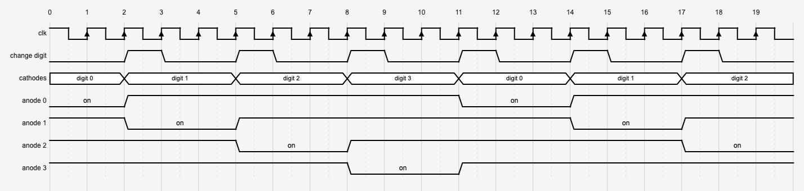
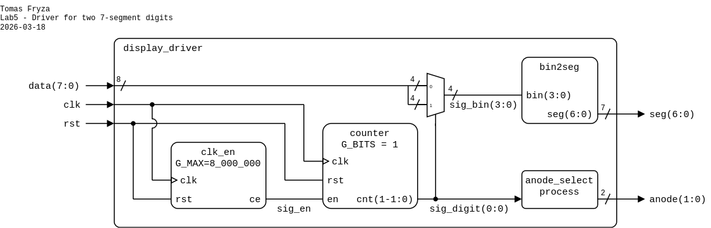
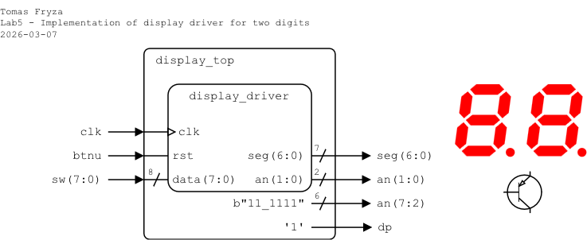
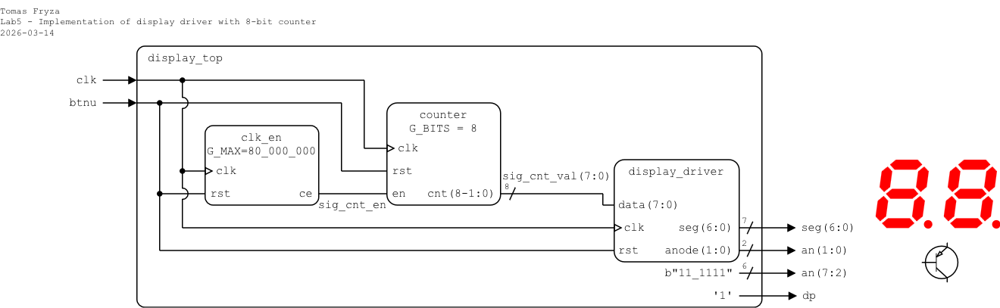
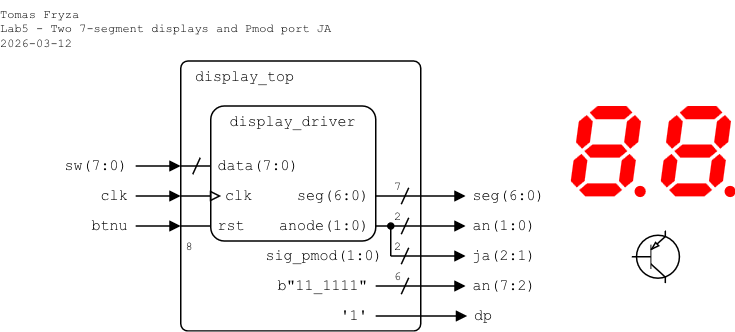

# Laboratory 5: Multiple seven-segment displays

* [Task 1: Two-digit display driver](#task1)
* [Task 2: Top-level design and FPGA implementation](#task2)
* [Optional tasks](#tasks)
* [Questions](#questions)
* [References](#references)

### Objectives

After completing this laboratory, students will be able to:

* Understand the hardware of 7-segment displays and the principles of multiplexing for multiple digits
* Use previously created VHDL modules (`clk_en`, `counter`, `bin2seg`) in new designs.
* Design and implement modular VHDL components for combinational and sequential logic.

### Background

The Nexys A7 board provides two four-digit common anode seven-segment LED displays (configured to behave like a single eight-digit display). Refer to the [schematic](https://github.com/tomas-fryza/vhdl-examples/blob/master/docs/nexys-a7-sch.pdf) or [reference manual](https://reference.digilentinc.com/reference/programmable-logic/nexys-a7/reference-manual) of the Nexys A7 board to determine how the 7-segment displays and push-buttons are conected. Here, the common anodes are switched to 3.3 V using **PNP-type transistors**, while the individual segments and decimal points are connected directly to eight output pins.

Additionally, recall from the electronics course the differences between NPN and PNP types of bipolar junction transistors (BJTs).

   

A common way to control multiple 7-segment displays is **multiplexing**, where the displays are switched sequentially. At any given moment, only one display is enabled and connected to the supply voltage. The individual segments are shared between all displays. Due to the persistence of human vision, the switching must be fast enough so that the complete value appears continuously visible. The total refresh period should not exceed **about 16&nbsp;ms**. For example, when displaying four digits, each digit is active for approximately&nbsp;4 ms. If eight digits are used, the active time for each digit is reduced to about 2&nbsp;ms. The figure below illustrates the general principle for four 7-segment displays.

   

<a name="task1"></a>

## Task 1: Two-digit display driver

1. Run Vivado, create a new RTL project named `display` and add a VHDL source file `display_driver`. Use the following I/O ports:

   | **Port name** | **Direction** | **Type** | **Description** |
   | :-: | :-: | :-- | :-- |
   | `clk` | in | `std_logic` | Main clock |
   | `rst` | in | `std_logic` | High-active synchronous reset |
   | `data` | in | `std_logic_vector(7 downto 0)` | Vector of input bits, 4 per digit |
   | `seg` | out | `std_logic_vector(6 downto 0)` | {a,b,c,d,e,f,g} active-low outputs |
   | `anode` | out | `std_logic_vector(1 downto 0)` | Anodes AN1..AN0 (active-low) |

2. In your project, add the design source files `clk_en.vhd`, `counter.vhd`, and `bin2seg.vhd` from the previous labs and check the **Copy sources into project** option. The selected files will be copied into the corresponding Vivado project folders, ensuring that the project contains local copies of all source files.

   

3. Use component declarations and instantiations of `clk_en`, `counter`, and `bin2seg`, and define the display driver architecture according to the following schematic and VHDL template.

   

   ```vhdl
   architecture Behavioral of display_driver is

       -- Component declaration for clock enable
       component clk_en is
           generic ( G_MAX : positive );
           port (
               clk : in  std_logic;
               rst : in  std_logic;
               ce  : out std_logic
           );
       end component clk_en;
    
       -- Component declaration for binary counter
       component counter is
           generic ( G_BITS : positive );
           port (
               clk : in  std_logic;
               rst : in  std_logic;
               en  : in  std_logic;
               cnt : out std_logic_vector(G_BITS - 1 downto 0)
           );
       end component counter;
    
       component bin2seg is

           -- TODO: Add component declaration of `bin2seg`

       end component bin2seg;
    
       -- Internal signals
       signal sig_en : std_logic;

       -- TODO: Add other needed signals

   begin

       ------------------------------------------------------------------------
       -- Clock enable generator for refresh timing
       ------------------------------------------------------------------------
       clock_0 : clk_en
           generic map ( G_MAX => 8 )  -- Adjust for flicker-free multiplexing
           port map (                  -- For simulation: 8
               clk => clk,             -- For implementation: 80_000_000
               rst => rst,
               ce  => sig_en
           );

       counter_0 : counter
           generic map ( G_BITS => 1 )
           port map (
               clk => clk,
               rst => rst,
               en  => sig_en,
               cnt => sig_digit
           );

       ------------------------------------------------------------------------
       -- Digit select
       ------------------------------------------------------------------------
       sig_bin <= data(3 downto 0) when sig_digit = "0" else
                  data(7 downto 4);

       ------------------------------------------------------------------------
       -- 7-segment decoder
       ------------------------------------------------------------------------
       decoder_0 : bin2seg
           port map (

               -- TODO: Add component instantiation of `bin2seg`

           );

       ------------------------------------------------------------------------
       -- Anode select process
       ------------------------------------------------------------------------
       p_anode_select : process (sig_digit) is
       begin
           case sig_digit is
               when "0" =>
                   anode <= "10";  -- Right digit active

               -- TODO: Add another anode selection(s)

               when others =>
                   anode <= "11";  -- All off
           end case;
       end process;

   end Behavioral;
   ```

4. Complete all **TODO** items in the architecture.

5. Create a VHDL simulation source file named `display_driver_tb` and [generate a testbench template](https://vhdl.lapinoo.net/testbench/).

6. Set the clock period to `10 ns` and verify the functionality of the display driver with several input data values.

   ```vhdl
   stimuli : process
   begin
       data <= (others => '0');

       -- Reset generation
       rst <= '1';
       wait for 50 ns;
       rst <= '0';

       data <= x"18";
       wait for 50 * TbPeriod;

       data <= x"19";
       wait for 50 * TbPeriod;

       data <= x"20";
       wait for 50 * TbPeriod;

       -- Stop the clock and hence terminate the simulation
       TbSimEnded <= '1';
       wait;
   end process;
   ```

7. Display all internal signals during the simulation.

   

8. Use **Flow > Open Elaborated design** and see the schematic after RTL analysis.

9. Use **Flow > Synthesis > Run Synthesis** and then see the schematic at the gate level.

<a name="task2"></a>

## Task 2: Top-level design and FPGA implementation

Choose one of the following variants and implement a display driver on the Nexys A7 board with switches (variant 1) or with 8-bit counter (variant 2).

### Variant 1: Switches

**Important:** Change the `G_MAX` parameter in the `clk_en` instantiation in the driver architecture to `80_000_000`. What is the resulting clock enable period for a 100&nbsp;MHz clock (10&nbsp;ns period)?

1. In your project, create a new VHDL design source file named `display_top`. Define I/O ports as follows.

   | **Port name** | **Direction** | **Type** | **Description** |
   | :-: | :-: | :-- | :-- |
   | `clk` | in | `std_logic` | Main clock |
   | `btnu` | in | `std_logic` | High-active synchronous reset |
   | `sw` | in | `std_logic_vector(7 downto 0)` | Input bits for two digits |
   | `seg` | out | `std_logic_vector(6 downto 0)` | Seven-segment cathodes CA..CG (active-low) |
   | `an` | out | `std_logic_vector(7 downto 0)` | Seven-segment anodes AN7..AN0 (active-low) |
   | `dp` | out | `std_logic` | Seven-segment decimal point (active-low, not used) |

2. Provide an instantiation of the `display_driver` circuit and complete the top-level architecture according to the following schematic and template.

   

   ```vhdl
   architecture Behavioral of display_top is

       component display_driver is

           -- TODO: Add component declaration of `display_driver`

       end component display_driver;

   begin

       ------------------------------------------------------------------------
       -- 7-segment display driver
       ------------------------------------------------------------------------
       display_0 : display_driver
           port map (

               -- TODO: Add component instantiation of `display_driver`

           );

       an(7 downto 2) <= b"11_1111";
       dp <= '1';

   end Behavioral;
   ```

3. Create a new constraints file named `nexys` (XDC file) and copy relevant pin assignments from the [Nexys A7-50T](../examples/nexys.xdc) template.

4. Implement your design to Nexys A7 board:

   1. Click **Generate Bitstream** (the process is time consuming and may take some time).
   2. Open **Hardware Manager**.
   3. Select **Open Target > Auto Connect** (make sure Nexys A7 board is connected and switched on).
   4. Click **Program device** and select the generated file `YOUR-PROJECT-FOLDER/display.runs/impl_1/display_top.bit`.

5. Modify the `G_MAX` parameter in the `display_driver.vhd` file so that the display does not appear to blink. What refresh period is sufficient for the human eye?

6. Use **Implementation > Open Implemented Design > Schematic** to see the generated structure.

### Variant 2: Counter

**Important:** Change the `G_MAX` parameter in the `clk_en` instantiation in the driver architecture to `80_000_000`. What is the resulting clock enable period for a 100&nbsp;MHz clock (10&nbsp;ns period)?

1. In your project, create a new VHDL design source file named `display_top`. Define I/O ports as follows.

   | **Port name** | **Direction** | **Type** | **Description** |
   | :-: | :-: | :-- | :-- |
   | `clk` | in | `std_logic` | Main clock |
   | `btnu` | in | `std_logic` | High-active synchronous reset |
   | `seg` | out | `std_logic_vector(6 downto 0)` | Seven-segment cathodes CA..CG (active-low) |
   | `an` | out | `std_logic_vector(7 downto 0)` | Seven-segment anodes AN7..AN0 (active-low) |
   | `dp` | out | `std_logic` | Seven-segment decimal point (active-low, not used) |

2. Provide an instantiation of the `display_driver` circuit, independent `clock_en` and 8-bit binary `counter`, and complete the top-level architecture according to the following schematic and template.

   

   ```vhdl
   architecture Behavioral of display_top is

       -- Component declaration for clock enable
       component clk_en is
           generic ( G_MAX : positive );
           port (
               clk : in  std_logic;
               rst : in  std_logic;
               ce  : out std_logic
           );
       end component clk_en;
    
       -- Component declaration for binary counter
       component counter is
           generic ( G_BITS : positive );
           port (
               clk : in  std_logic;
               rst : in  std_logic;
               en  : in  std_logic;
               cnt : out std_logic_vector(G_BITS - 1 downto 0)
           );
       end component counter;

       component display_driver is

           -- TODO: Add component declaration of `display_driver`

       end component display_driver;

       -- Internal signals
       signal sig_cnt_en  : std_logic;
       signal sig_cnt_val : std_logic_vector(7 downto 0);

   begin

       ------------------------------------------------------------------------
       -- 8-bit counter
       ------------------------------------------------------------------------
       clock_1 : clk_en
           generic map ( G_MAX => 25_000_000 )  -- Adjust counter speed
           port map (
               clk => clk,
               rst => rst,
               ce  => sig_cnt_en
           );

       counter_1 : counter
           generic map ( G_BITS => 8 )
           port map (

               -- TODO: Add component instantiation of `counter`

           );

       ------------------------------------------------------------------------
       -- 7-segment display driver
       ------------------------------------------------------------------------
       display_0 : display_driver
           port map (

               -- TODO: Add component instantiation of `display_driver`

           );

       an(7 downto 2) <= b"11_1111";
       dp <= '1';

   end Behavioral;
   ```

3. Create a new constraints file named `nexys` (XDC file) and copy relevant pin assignments from the [Nexys A7-50T](../examples/nexys.xdc) template.

4. Implement your design to Nexys A7 board:

   1. Click **Generate Bitstream** (the process is time consuming and may take some time).
   2. Open **Hardware Manager**.
   3. Select **Open Target > Auto Connect** (make sure Nexys A7 board is connected and switched on).
   4. Click **Program device** and select the generated file `YOUR-PROJECT-FOLDER/display.runs/impl_1/display_top.bit`.

5. Modify the `G_MAX` parameter in the `display_driver.vhd` file so that the display does not appear to blink. What refresh period is sufficient for the human eye?

6. Use **Implementation > Open Implemented Design > Schematic** to see the generated structure.

<a name="tasks"></a>

## Optional tasks

**Pmod (Peripheral Module)** ports are standardized 6- or 12-pin connectors on FPGA and microcontroller boards, used to interface with external peripheral modules like sensors, displays, or communication devices. They provide digital I/O signals, power (VCC), and ground, making it easy to connect add-on modules without complex wiring. On the Nexys A7 board, Pmod ports can be used to drive LEDs, connect switches, or read data from external devices.

   

1. Modify the top-level design to use Pmod ports, and verify the period of the anode signals using an external logic analyzer.

   

2. Extend the `display_driver` design to control four or even eight 7-segment displays.

<a name="questions"></a>

## Questions

1. Explain how the common-anode 7-segment displays are connected on the Nexys A7 board. How are the anodes and segments controlled?

2. What is the purpose of using PNP transistors in the display driver circuit? Why can not the segments be driven directly without them?

3. Describe how multiplexing works for multiple 7-segment displays. Why is a fast refresh rate required?

4. How would you modify your design to extend from two digits to four or eight digits? What changes are needed in the counter width and anode selection logic?

5. What is the role of the `clk_en` component? How does changing the `G_MAX` parameter affect the display behavior?

6. Describe the steps required to implement the top-level design on the Nexys A7 board. What role do XDC constraints play in this process?

<a name="references"></a>

## References

<!--
1. Bharadwaj. [Seven Segment Display Working Principle](https://engineeringtutorial.com/seven-segment-display-working-principle/)
-->

1. Digilent blog. [Nexys A7 Reference Manual](https://reference.digilentinc.com/reference/programmable-logic/nexys-a7/reference-manual)

2. [WaveDrom - Digital Timing Diagram everywhere](https://wavedrom.com/)

3. Tomas Fryza. [Driver for 7-segment display](https://www.edaplayground.com/x/3f_A)

4. Digilent. [General .xdc file for the Nexys A7-50T](https://github.com/Digilent/digilent-xdc/blob/master/Nexys-A7-50T-Master.xdc)
