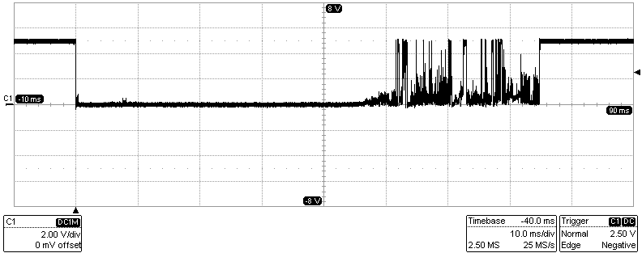
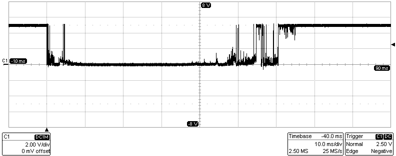
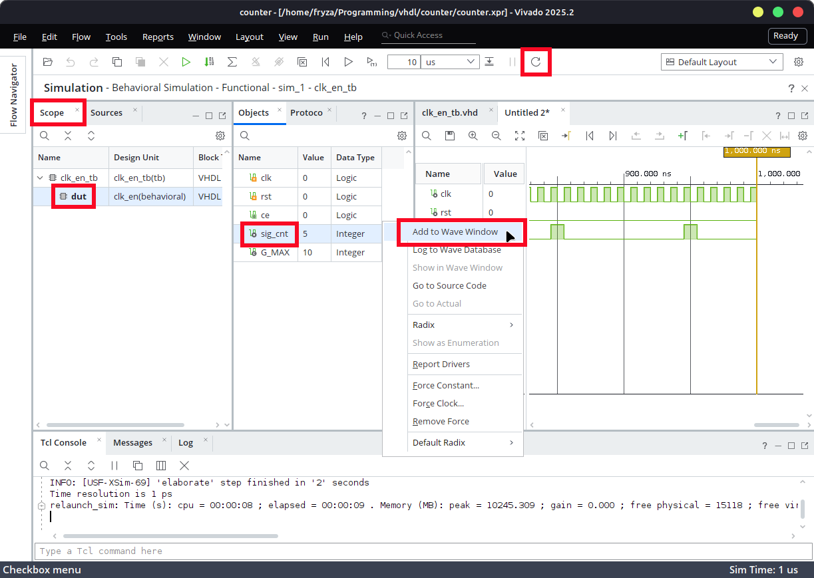
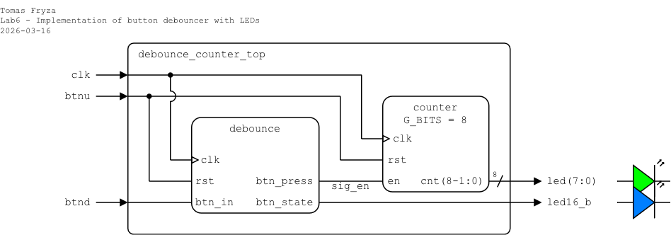
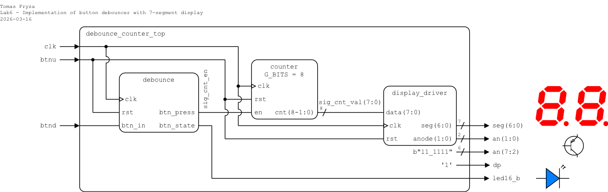

# Laboratory 6: Button debounce

* [Task 1: Debounce button](#task1)
* [Task 2: Top-level design and FPGA implementation](#task2)
* [Optional tasks](#tasks)
* [Questions](#questions)
* [References](#references)

### Objectives

After completing this laboratory, students will be able to:

* Understand the button bounce effect and how to debounce it
* Use edge detectors
* TBD


### Background

The Nexys A7 board provides five **push buttons**. Refer to the [schematic](https://github.com/tomas-fryza/vhdl-examples/blob/master/docs/nexys-a7-sch.pdf) or [reference manual](https://reference.digilentinc.com/reference/programmable-logic/nexys-a7/reference-manual) of the Nexys A7 board to determine how the push-buttons are conected and what is their active level.

   

A **bouncy button**, also known as a "bouncing switch" or "switch bounce," refers to the phenomenon where the electrical contacts in a mechanical switch make multiple, rapid transitions between open and closed states when pressed or released. This can lead to multiple erroneous signals being sent to a circuit. Examples of real push buttons can be seen below. (Note that, the active level of the button here is low.)

   

   

The main methods to debounce a bouncy button are:

   1. **[Hardware Debouncing](https://www.digikey.ee/en/articles/how-to-implement-hardware-debounce-for-switches-and-relays)**: Hardware debouncing involves adding additional circuitry or components to the switch or input signal path to eliminate or reduce the effects of bouncing, such as capacitors, resistors, and Schmitt triggers.

      

   2. **Software Debouncing**: This method involves using software algorithms to filter out the noise and ensure that only a single, stable signal transition is recognized. Common techniques include implementing delay-based algorithms, state machines, or using timers.

   3. **Combination Approach**: Often, a combination of software and hardware debouncing methods is employed to achieve robust debouncing.

<a name="task1"></a>

## Task 1: Debounce button

1. Run Vivado, create a new RTL project named `debounce` and add a VHDL source file `debounce`. Use the following I/O ports:

      | **Port name** | **Direction** | **Type** | **Description** |
      | :-: | :-: | :-- | :-- |
      | `clk` | in  | `std_logic` | Main clock |
      | `rst` | in  | `std_logic` | High-active synchronous reset |
      | `btn_in` | in  | `std_logic` | Bouncey button input |
      | `btn_state` | out | `std_logic` | Debounced level |
      | `btn_press` | out | `std_logic` | 1-clock press pulse |

2. In your project, add the design source files `clk_en.vhd` from the previous lab(s) and check the **Copy sources into project** option. The selected file will be copied into the corresponding Vivado project folders, ensuring that the project contains local copies of all source files.

   

3. Use component declarations and instantiations of `clk_en` and define the button debouncer architecture using the following sections:

   1. The **synchronizer** consists of two flip-flops (`sync0` and `sync1`) used to eliminate metastability when handling asynchronous inputs. The input signal `btn_in` is first passed through `sync0` and then through `sync1` on each clock cycle. This ensures that any glitches or inconsistencies in the input are filtered out, producing a stable signal to be processed in subsequent stages.

   2. The **shift register**, defined by `shift_reg`, is a series of flip-flops (a vector) that stores the history of the synchronized input signal. Each clock cycle, the new value of `sync1` is shifted into the register, and the oldest value is discarded. This allows the debounce logic to track a series of past values and determine if the button has been in a stable state (either high or low) for a defined number of clock cycles, effectively filtering out noise from button bouncing.

   3. Generate **output signals**. The final debounced signal `btn_state` represents the stable state of the button after filtering out noise and bouncing. A one-clock pulse signal `btn_press` is asserted when the button transitions from released (0) to pressed (1).

   ```vhdl
   architecture Behavioral of debounce is
       ----------------------------------------------------------------
       -- Constants
       ----------------------------------------------------------------
       constant C_SHIFT_LEN : positive := 8;  -- Debounce history
       constant C_MAX       : positive := 2;  -- Sampling period
                                              -- 2 for simulation
                                              -- 100_000 (1 ms) for implementation !!!

       ----------------------------------------------------------------
       -- Internal signals
       ----------------------------------------------------------------
       signal ce_sample : std_logic;

       signal sync0 : std_logic;
       signal sync1 : std_logic;

       signal shift_reg : std_logic_vector(C_SHIFT_LEN-1 downto 0);

       signal debounced      : std_logic;
       signal debounced_prev : std_logic;

       -- Component declaration for clock enable
       component clk_en is
           generic ( G_MAX : positive );
           port (
               clk : in  std_logic;
               rst : in  std_logic;
               ce  : out std_logic
           );
       end component clk_en;

   begin
       ----------------------------------------------------------------
       -- Clock enable instance (your module)
       ----------------------------------------------------------------
       clock_0 : clk_en
           generic map ( G_MAX => C_MAX )
           port map (
               clk => clk,
               rst => rst,
               ce  => ce_sample
           );

       ----------------------------------------------------------------
       -- Synchronizer + debounce
       ----------------------------------------------------------------
       p_debounce : process(clk)
       begin
           if rising_edge(clk) then
               if rst = '1' then
                   sync0 <= '0';
                   sync1 <= '0';
                   shift_reg <= (others => '0');
                   debounced <= '0';
                   debounced_prev <= '0';

               else
                   -- Input synchronizer
                   sync1 <= sync0;
                   sync0 <= btn_in;

                   -- Sample only when enable pulse occurs
                   if ce_sample = '1' then

                       -- Shift values to the left and load a new sample as LSB
                       shift_reg <= shift_reg(C_SHIFT_LEN-2 downto 0) & sync1;

                       -- Check if all bits are '1'
                       if shift_reg = (shift_reg'range => '1') then
                           debounced <= '1';
                       -- Check if all bits are '0'
                       elsif shift_reg = (shift_reg'range => '0') then
                           debounced <= '0';
                       end if;

                   end if;

                   debounced_prev <= debounced;

               end if;
           end if;
       end process;

       ----------------------------------------------------------------
       -- Outputs
       ----------------------------------------------------------------
       btn_state <= debounced;

       -- One-clock pulse when button pressed
       btn_press <= not(debounced_prev) and debounced;

   end architecture Behavioral;
   ```

4. Create a VHDL simulation source file named `debounce_tb` and [generate a testbench template](https://vhdl.lapinoo.net/testbench/).

5. Set the clock period to `10 ns` and verify the functionality of the debouncer.

   ```vhdl
   p_stim : process
   begin
       btn_in <= '0';

       -- Reset generation
       rst <= '1';
       wait for 50 ns;
       rst <= '0';

       -- Simulate button bounce on press
       report "Simulating button press with bounce";

       wait for 100 ns;
       btn_in <= '1';
       wait for 50 ns;
       btn_in <= '0';
       wait for 50 ns;
       btn_in <= '1';
       wait for 250 ns;
       btn_in <= '0';  -- final stable press

       -- Simulate button bounce on release
       report "Simulating button release with bounce";

       wait for 20 ns;
       btn_in <= '1';
       wait for 60 ns;
       btn_in <= '0';
       wait for 30 ns;
       btn_in <= '1';
       wait for 50 ns;
       btn_in <= '0';  -- final release
       wait for 300 ns;

       -- Stop the clock and hence terminate the simulation
       report "Simulation finished";
       TbSimEnded <= '1';
       wait;

    end process;
   ```

6. Display the internal shift register signal during the simulation.

   

7. Use **Flow > Open Elaborated design** and see the schematic after RTL analysis.

8. Use **Flow > Synthesis > Run Synthesis** and then see the schematic at the gate level.

9. (Optional:) Extend the edge detector also to the situation when the input transitions from high to low: add output signal `btn_release` to entity and architecture.

   

<a name="task2"></a>

## Task 2: Top-level design and FPGA implementation

Choose one of the following variants and implement a button-triggered binary counter on the Nexys A7 board with LEDs (variant 1) or with 7-segment display driver (variant 2).

### Variant 1: LEDs

**Important:** Change the `C_MAX` constant in the debouncer architecture to `100_000`. What is the resulting clock enable period for a 100&nbsp;MHz clock (10&nbsp;ns period)?

1. In your project, create a new VHDL design source file named `debounce_counter_top`. Define I/O ports as follows.

   | **Port name** | **Direction** | **Type** | **Description** |
   | :-: | :-: | :-- | :-- |
   | `clk` | in | `std_logic` | Main clock |
   | `btnu` | in | `std_logic` | High-active synchronous reset |
   | `btnd` | in | `std_logic` | Increment counter |
   | `led` | out | `std_logic_vector(7 downto 0)` | Counter value |
   | `led16_b` | out | `std_logic` | Button indicator |

2. In your project, add the design source files `counter.vhd` from the previous lab(s) and check the **Copy sources into project** option. The selected file will be copied into the corresponding Vivado project folders, ensuring that the project contains local copies of all source files.

2. Provide an instantiation of the `debounce` and `counter` circuits and complete the top-level architecture according to the following schematic and template.

   

   ```vhdl
   architecture Behavioral of debounce_counter_top is

       component debounce is

           -- TODO: Add component declaration of `debounce`

       end component debounce;

       component counter is

           -- TODO: Add component declaration of `counter`

       end component counter;

       -- Internal signals
       -- TODO: Ass needed signals
   begin

       ------------------------------------------------------------------------
       -- Button debouncer
       ------------------------------------------------------------------------
       debounce_0 : debounce
           port map (

               -- TODO: Add component instantiation of `debounce`

           );

       ------------------------------------------------------------------------
       -- Counter
       ------------------------------------------------------------------------
       counter_0 : counter
           generic map ( G_BITS = 8 )
           port map (

               -- TODO: Add component instantiation of `counter`

           );

   end Behavioral;
   ```

3. Create a new constraints file named `nexys` (XDC file) and copy relevant pin assignments from the [Nexys A7-50T](../examples/nexys.xdc) template.

4. Implement your design to Nexys A7 board:

   1. Click **Generate Bitstream** (the process is time consuming and may take some time).
   2. Open **Hardware Manager**.
   3. Select **Open Target > Auto Connect** (make sure Nexys A7 board is connected and switched on).
   4. Click **Program device** and select the generated file `YOUR-PROJECT-FOLDER/debounce.runs/impl_1/debounce_counter_top.bit`.

5. Use **Implementation > Open Implemented Design > Schematic** to see the generated structure.

### Variant 2: Display driver

**Important:** Change the `C_MAX` constant in the debouncer architecture to `100_000`. What is the resulting clock enable period for a 100&nbsp;MHz clock (10&nbsp;ns period)?

1. In your project, create a new VHDL design source file named `debounce_counter_top`. Define I/O ports as follows.

   TBD

   

   TBD


<a name="tasks"></a>

## Optional tasks

TBD

<!--
3. Use iterative `generate` statement from the [previous lab](https://github.com/tomas-fryza/vhdl-course/tree/master/lab6-lfsr#part3) and extend the instantiation of `debounce` component to several buttons.
-->


<a name="questions"></a>

## Questions

TBD


<a name="references"></a>

## References

1. Clive Maxfield. [How to Implement Hardware Debounce for Switches and Relays When Software Debounce Isn’t Appropriate](https://www.digikey.ee/en/articles/how-to-implement-hardware-debounce-for-switches-and-relays)
