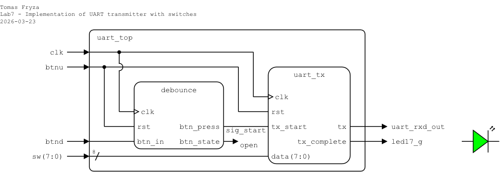
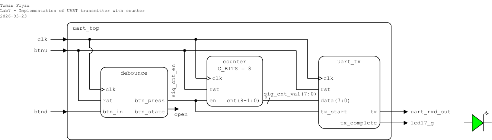
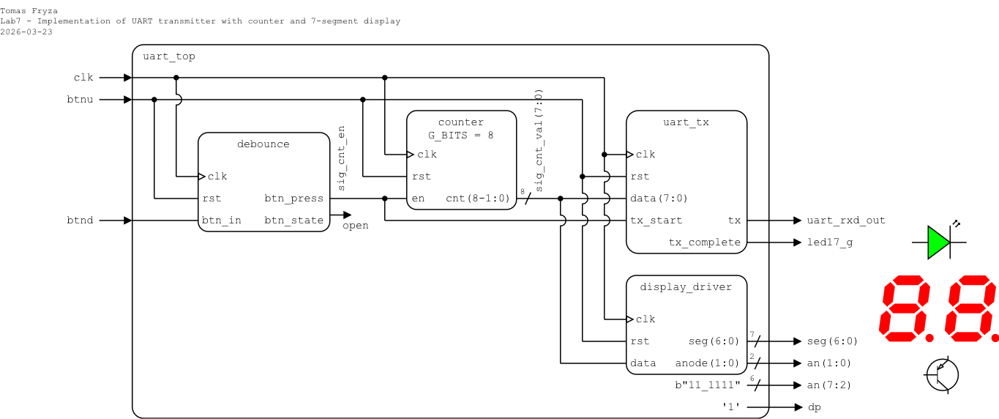

# Lab 7: UART transmitter

* [Task 1: UART transmitter](#task1)
* [Task 2: Top-level design and FPGA implementation](#task2)
* [Task 3: Hardware resource usage](#task3)
* [Optional tasks](#tasks)
* [Questions](#questions)
* [References](#references)

### Objectives

After completing this laboratory, students will be able to:

* Understand the philosophy and use of finite state machines
* Use state diagrams
* Understand the difference between Mealy and Moore type of FSM in VHDL
* Understand the UART interface

### Background

#### Finite State Machine

A **Finite State Machine (FSM)** is a mathematical model used to describe and represent the behavior of systems that can be in a finite number of states at any given time. It consists of a set of states, transitions between these states, and actions associated with these transitions.

The main properties of using FSMs include:

   1. **Determinism**: FSMs are deterministic if, for each state and input, there is exactly one transition to a next state. This property simplifies analysis and implementation.

   2. **State Memory**: FSMs inherently have memory as they retain information about their current state. This allows them to model systems with sequential behavior.

   3. **Simplicity**: FSMs are relatively simple and intuitive to understand, making them useful for modeling and designing systems with discrete and sequential behavior.

   4. **Parallelism**: FSMs can represent parallelism by having multiple state machines working concurrently, each handling different aspects of the system.

One widely used method to illustrate a finite state machine is through a **state diagram**, comprising circles connected by directed arcs. Each circle denotes a machine state labeled with its name, and, in the case of a Moore machine, an [output value](https://ocw.mit.edu/courses/electrical-engineering-and-computer-science/6-004-computation-structures-spring-2017/c6/c6s1/) associated with the state.

   

Directed arcs signify the transitions between states in a finite state machine (FSM). For a Mealy machine, these arcs are labeled with input/output pairs, while for a Moore machine, they are labeled solely with inputs. Make sure, arcs leaving a state must be:

   * **mutually exclusive**: can not have two choices for a given input value and

   * **collectively exhaustive**: every state must specify what happens for each possible input combination; "nothing happens" means arc back to itself.

   

#### UART communication

The **UART (Universal Asynchronous Receiver-Transmitter)** is not a communication protocol like SPI and I2C, but a physical circuit in a microcontroller, or a stand-alone integrated circuit, that translates communicated data between serial and parallel forms. It is one of the simplest and easiest method for implement and understanding.

In [UART communication](https://www.analog.com/en/analog-dialogue/articles/uart-a-hardware-communication-protocol.html), two UARTs communicate directly with each other. The transmitting UART converts parallel data from a CPU into serial form, transmits it in serial to the receiving UART, which then converts the serial data back into parallel data for the receiving device. Only two wires are needed to transmit data between two UARTs. Data flows from the Tx pin of the transmitting UART to the Rx pin of the [receiving UART](https://www.circuitbasics.com/basics-uart-communication/).

UARTs transmit data asynchronously, which means there is no external clock signal to synchronize the output of bits from the transmitting UART. Instead, timing is agreed upon in advance between both units, and special **Start** (log. 0) and 1 or 2 **Stop** (log. 1) bits are added to each data package. These bits define the beginning and end of the data packet so the receiving UART knows when to start reading the bits. In addition to the start and stop bits, the packet/frame also contains data bits and optional parity.

The amount of **data** in each packet can be set from 5 to 9 bits. If it is not otherwise stated, data is transferred least-significant bit (LSB) first.

**Parity** is a form of very simple, low-level error checking and can be Even or Odd. To produce the parity bit, add all 5-9 data bits and extend them to an even or odd number. For example, assuming parity is set to even and was added to a data byte `0110_1010`, which has an even number of 1's (4), the parity bit would be set to 0. Conversely, if the parity mode was set to odd, the parity bit would be 1.

One of the most common UART formats is called **9600 8N1**, which means 8 data bits, no parity, 1 stop bit and a symbol rate of 9600&nbsp;Bd.


<a name="task1"></a>

## Task 1: UART transmitter

1. Run Vivado, create a new RTL project named `uart`, and create a VHDL design source file named `uart_tx`. Use the following I/O ports and implement an FSM version of UART transmitter 8N1 on Nexys A7-50T:

   | **Port name** | **Direction** | **Type** | **Description** |
   | :-: | :-: | :-- | :-- |
   | `clk` | in  | `std_logic` | Main clock |
   | `rst` | in  | `std_logic` | High-active synchronous reset |
   | `data` | in | `std_logic_vector(7 downto 0)` | Data to transmit |
   | `tx_start` | in | `std_logic` | Start transmission signal |
   | `tx` | out | `std_logic` | UART transmit line |
   | `tx_complete` | out | `std_logic` | Transmission completion signal |

2. In architecture declaration section, define constants for proper UART timing, four states for the FSM, and internal signals to count a sequence of data bits and clock periods.

   ```vhdl
   architecture Behavioral of uart_tx is

       -- Constants for baud rate and clock frequency
       constant CLK_FREQ : integer := 100_000_000;  -- System clock frequency (100 MHz)
       constant BAUDRATE : integer := 9_600;        -- Baud rate (9600 Bd)

       -- Number of clock cycles per bit period for baud rate timing
       constant MAX : integer := 2;  -- 2 for simulation
                                     -- CLK_FREQ / BAUDRATE for implementation

       -- FSM state definitions
       type state_type is (IDLE, TRANSMIT_START_BIT, TRANSMIT_DATA, TRANSMIT_STOP_BIT);
       signal current_state : state_type;

       -- Internal signals
       signal current_bit_index : integer range 0 to 7;          -- Index for current bit being transmitted
       signal shift_reg         : std_logic_vector(7 downto 0);  -- Data shift register
       signal baud_count        : integer range 0 to MAX-1;      -- Clock cycles for one bit period
   ```

3. Complete the architecture body section according to the following template.

   ```vhdl
   begin
       -- UART Transmitter FSM process driven by the main clock (clk)
       p_transmitter : process (clk)
       begin
           if rising_edge(clk) then
               if rst = '1' then
                   -- Reset state, outputs, and all internal signals
                   current_state     <= IDLE;             -- Start in IDLE state
                   tx                <= '1';              -- UART line idle (high)
                   tx_complete       <= '0';              -- Transmission not completed
                   current_bit_index <= 0;                -- Reset bit index
                   shift_reg         <= (others => '0');  -- Clear shift register
                   baud_count        <= 0;                -- Reset the baud rate counter

               else
                   case current_state is

                       -- IDLE: Wait for the start signal to begin transmission
                       when IDLE =>
                           -- TODO: Keep Tx line to high

                           -- TODO: Clear done to 0

                           if tx_start = '1' then
                               current_state <= TRANSMIT_START_BIT;
                               shift_reg <= data;       -- Load data into shift register
                               current_bit_index <= 0;  -- Start transmitting the least significant bit
                               baud_count <= 0;         -- Reset baud count for the new transmission
                           end if;

                       -- TRANSMIT_START_BIT: Transmit the start bit (low)
                       when TRANSMIT_START_BIT =>
                           -- TODO: Start bit is always '0'

                           -- Wait for the baud period to complete
                           if baud_count = MAX - 1 then
                               current_state <= TRANSMIT_DATA;
                               baud_count <= 0;
                           else
                               baud_count <= baud_count + 1;
                           end if;

                       -- TRANSMIT_DATA: Transmit the 8 data bits, LSB first
                       when TRANSMIT_DATA =>
                           -- TODO: Transmit the least significant bit (LSB) from shift reg.

                           -- Wait for the baud period to complete
                           if baud_count = MAX - 1 then
                               shift_reg <= '0' & shift_reg(7 downto 1);  -- Shift the data right by one bit

                               -- Check if all 8 data bits have been transmitted
                               if current_bit_index = 7 then
                                   current_state <= TRANSMIT_STOP_BIT;
                               else
                                   current_bit_index <= current_bit_index + 1;  -- Move to next bit
                               end if;

                               baud_count <= 0;  -- Reset baud counter for the next bit
                           else
                               baud_count <= baud_count + 1;  -- Increment the baud counter
                           end if;

                       -- TRANSMIT_STOP_BIT: Transmit the stop bit (high)
                       when TRANSMIT_STOP_BIT =>
                           -- TODO: Stop bit is always '1'
                           
                           -- TODO: Indicate transmission is complete

                           -- Wait for the baud period to complete
                           if baud_count = MAX - 1 then
                               current_state <= IDLE;
                           else
                               baud_count <= baud_count + 1;  -- Increment the baud counter
                           end if;

                       -- Default: In case of an unexpected state, return to IDLE
                       when others =>
                           current_state <= IDLE;

                   end case;
               end if;
           end if;
       end process p_transmitter;

   end Behavioral;
   ```

4. Complete all **TODO** items in the architecture section.

5. Create a VHDL simulation source file named `uart_tx_tb` and [generate a testbench template](https://vhdl.lapinoo.net/testbench/).

6. Set the clock period to `constant TbPeriod : time := 10 ns;` and verify the functionality of the transmitter.

   ```vhdl
   stimuli : process
   begin
       -- Initialization
       data <= (others => '0');
       tx_start <= '0';

       report "Reset generation";
       rst <= '1';
       wait for 50 ns;
       rst <= '0';
       wait for 50 ns;

       -------------------------------------------------
       report "Send first byte: 0x44";
       data <= x"44";
       tx_start <= '1';
       wait for TbPeriod;
       tx_start <= '0';

       -- Wait until transmission is complete
       wait until tx_complete = '1';
       wait for 10 * TbPeriod;  -- Small gap

       -------------------------------------------------
       report "Send next byte: 0x45";
       data <= x"45";
       tx_start <= '1';
       wait for TbPeriod;
       tx_start <= '0';

       wait until tx_complete = '1';
       wait for 10 * TbPeriod;

       -------------------------------------------------
       report "Send next byte: 0x31";
       data <= x"31";
       tx_start <= '1';
       wait for TbPeriod;
       tx_start <= '0';

       wait until tx_complete = '1';
       wait for 10 * TbPeriod;

       -------------------------------------------------
       report "Stop the clock and hence terminate the simulation";
       TbSimEnded <= '1';
       wait;
   end process;
   ```

7. Display the internal signals named `shift_reg`, `current_state` etc. in the waveform during the simulation.

<a name="task2"></a>

## Task 2: Top-level design and FPGA implementation

Choose one of the following variants and implement an UART transmitter on the Nexys A7 board using switches (variant 1) or a counter (variant 2).

### Variant 1: Switches

**Important:** Change the `MAX` constant in the `uart_tx` architecture to `integer := CLK_FREQ / BAUDRATE;`.

1. In your project, create a new VHDL design source file named `uart_top`. Define I/O ports as follows.

   | **Port name** | **Direction** | **Type** | **Description** |
   | :-: | :-: | :-- | :-- |
   | `clk` | in | `std_logic` | Main clock |
   | `btnu` | in | `std_logic` | High-active synchronous reset |
   | `sw` | in | `std_logic_vector(7 downto 0)` | Data to trřansmit |
   | `btnd` | in | `std_logic` | Start transmission |
   | `uart_rxd_out` | out | `std_logic` | UART transmit line |
   | `led17_g` | out | `std_logic` | Transmission completed |

2. In your project, add the design source files `debounce.vhd` and `clk_en.vhd` from the previous lab(s). When adding the file in Vivado, enable the **Copy sources into project** option so that the file is copied into the current project directory.

3. Instantiate the `debounce` and `uart_tx` circuits, and complete the top-level architecture according to the following schematic and template.

   

   ```vhdl
   architecture Behavioral of uart_top is

       component debounce is
           Port ( clk       : in  STD_LOGIC;
                  rst       : in  STD_LOGIC;
                  btn_in    : in  STD_LOGIC;
                  btn_state : out STD_LOGIC;
                  btn_press : out STD_LOGIC);
       end component debounce;

       component uart_tx is

           -- TODO: Add component declaration of `uart_tx`

       end component uart_tx;

       -- Internal signal(s)
       signal sig_start : std_logic;

   begin

       ------------------------------------------------------------------------
       -- Button debouncer
       ------------------------------------------------------------------------
       debounce_inst : debounce
           port map (
               clk       => clk,
               rst       => btnu,
               btn_in    => btnd,
               btn_press => sig_start,
               btn_state => open
           );

       ------------------------------------------------------------------------
       -- UART transmitter
       ------------------------------------------------------------------------
       uart_inst : uart_tx
           port map (

               -- TODO: Add component instantiation of `uart_tx`

           );

   end Behavioral;
   ```

4. Complete all **TODO** items in the architecture section.

5. Create a new constraints file named `nexys` (XDC file) and copy relevant pin assignments from the [Nexys A7-50T](../examples/nexys.xdc) template.

   > **Note:**
   > * Your transmitter signal `tx` must be connected to onboard FTDI FT2232HQ USB-UART bridge receiver, ie. use pin number `D4` which is maped in XDC template to `uart_rxd_out` (see [Nexys A7 reference manual, section 6](https://digilent.com/reference/programmable-logic/nexys-a7/reference-manual?redirect=1)).

6. Implement your design to Nexys A7 board:

   1. Click **Generate Bitstream** (the process is time consuming and may take some time).
   2. Open **Hardware Manager**.
   3. Select **Open Target > Auto Connect** (make sure Nexys A7 board is connected and switched on).
   4. Click **Program device** and select the generated file `YOUR-PROJECT-FOLDER/uart.runs/impl_1/uart_top.bit`.

7. Use [online serial monitor](https://hhdsoftware.com/online-serial-port-monitor) or Putty and receive the serial data transmitted from the FPGA board as ASCII codes, which you can look up on this [ASCII code chart](https://www.ascii-code.com/).

8. Use 7-segment display and/or 8 LEDs to show the input data value.

### Variant 2: Counter

1. In your project, create a new VHDL design source file named `uart_top`. Define I/O ports as follows.

   | **Port name** | **Direction** | **Type** | **Description** |
   | :-: | :-: | :-- | :-- |
   | `clk` | in | `std_logic` | Main clock |
   | `btnu` | in | `std_logic` | High-active synchronous reset |
   | `btnd` | in | `std_logic` | Start transmission |
   | `uart_rxd_out` | out | `std_logic` | UART transmit line |
   | `led17_g` | out | `std_logic` | Transmission completed |

2. In your project, add the design source files `debounce.vhd`, `clk_en.vhd`, and `counter.vhd` from the previous lab(s). When adding the file in Vivado, enable the **Copy sources into project** option so that the file is copied into the current project directory.

3. Instantiate the circuits and complete the top-level architecture according to the following schematic and template.

   

   ```vhdl
   architecture Behavioral of uart_top is

       component debounce is
           Port ( clk       : in  STD_LOGIC;
                  rst       : in  STD_LOGIC;
                  btn_in    : in  STD_LOGIC;
                  btn_state : out STD_LOGIC;
                  btn_press : out STD_LOGIC);
       end component debounce;

       component counter is

           -- TODO: Add component declaration of `counter`

       end component counter;

       component uart_tx is

           -- TODO: Add component declaration of `uart_tx`

       end component uart_tx;

       -- Internal signal(s)
       signal sig_cnt_en  : std_logic;
       signal sig_cnt_val : std_logic_vector(7 downto 0);

   begin

       ------------------------------------------------------------------------
       -- Button debouncer
       ------------------------------------------------------------------------
       debounce_inst : debounce
           port map (
               clk       => clk,
               rst       => btnu,
               btn_in    => btnd,
               btn_press => sig_cnt_en,
               btn_state => open
           );

       ------------------------------------------------------------------------
       -- Binary counter
       ------------------------------------------------------------------------
       counter_inst : counter
           generic map ( G_BITS => 8 )
           port map (

               -- TODO: Add component instantiation of `counter`

           );

       ------------------------------------------------------------------------
       -- UART transmitter
       ------------------------------------------------------------------------
       uart_inst : uart_tx
           port map (

               -- TODO: Add component instantiation of `uart_tx`

           );

   end Behavioral;
   ```

4. Complete all **TODO** items in the architecture section.

5. Create a new constraints file named `nexys` (XDC file) and copy relevant pin assignments from the [Nexys A7-50T](../examples/nexys.xdc) template.

   > **Note:**
   > * Your transmitter signal `tx` must be connected to onboard FTDI FT2232HQ USB-UART bridge receiver, ie. use pin number `D4` which is maped in XDC template to `uart_rxd_out` (see [Nexys A7 reference manual, section 6](https://digilent.com/reference/programmable-logic/nexys-a7/reference-manual?redirect=1)).

6. Implement your design to Nexys A7 board:

   1. Click **Generate Bitstream** (the process is time consuming and may take some time).
   2. Open **Hardware Manager**.
   3. Select **Open Target > Auto Connect** (make sure Nexys A7 board is connected and switched on).
   4. Click **Program device** and select the generated file `YOUR-PROJECT-FOLDER/uart.runs/impl_1/uart_top.bit`.

7. Use [online serial monitor](https://hhdsoftware.com/online-serial-port-monitor) or Putty and receive the serial data transmitted from the FPGA board as ASCII codes, which you can look up on this [ASCII code chart](https://www.ascii-code.com/).

<a name="task3"></a>

## Task 3: Hardware resource usage

1. Use **Flow > RTL Analysis > Open Elaborated design** and see the **Schematic** after RTL analysis.

2. Use **Flow > Synthesis > Run Synthesis** and then see the **Schematic** at the gate level.

3. Use the **Report Utilization** after the **Synthesis** and see the number of LUT (Look-Up Table), FF (Flip-Flop), and IO ports used in the implementation.

4. Use **Implementation > Open Implemented Design > Schematic** to see the generated structure.

<a name="tasks"></a>

## Optional tasks

1. Extend the previous task by adding a `display_driver` and display the transmitted ASCII code on a 7-segment display. What ASCII code is displayed at any given time?

   

2. Extend the design to support parity bits.

3. In the `*.xdc` constraints file, remap the UART outputs to any Pmod port on the Nexys A7 board, and display the UART values on an oscilloscope or logic analyzer.

   

   Connect the logic analyzer to your Pmod pins, including GND. Launch the **Logic** analyzer software and start the capture. The Saleae Logic software offers a decoding feature to transform the captured signals into meaningful UART messages. Click the **+ button** in the **Analyzers** section and set up the **Async Serial** decoder.

      

      > **Note:** To perform this analysis, you will need a logic analyzer such as [Saleae](https://www.saleae.com/) or [similar](https://www.amazon.com/KeeYees-Analyzer-Device-Channel-Arduino/dp/B07K6HXDH1/ref=sr_1_6?keywords=saleae+logic+analyzer&qid=1667214875&qu=eyJxc2MiOiI0LjIyIiwicXNhIjoiMy45NSIsInFzcCI6IjMuMDMifQ%3D%3D&sprefix=saleae+%2Caps%2C169&sr=8-6) device. Additionally, you should download and install the [Saleae Logic 1](https://support.saleae.com/logic-software/legacy-software/older-software-releases#logic-1-x-download-links) or [Saleae Logic 2](https://www.saleae.com/downloads/) software on your computer.
      >
      > You can find a comprehensive tutorial on utilizing logic analyzer in this [video](https://www.youtube.com/watch?v=CE4-T53Bhu0).

<a name="questions"></a>

## Questions

1. List all states used in your UART transmitter FSM and describe their purpose.

2. What does it mean that FSM transitions must be mutually exclusive and collectively exhaustive?

3. What is the difference between Mealy and Moore FSM? Is your UART transmitter closer to a Mealy or Moore machine? Explain why.

4. Explain the structure of a UART frame in the 8N1 format. Why is a start bit necessary in UART communication?

5. What is ASCII, and why is it used in digital communication systems?

6. What is the ASCII code (in hex or binary) for a selected character (e.g., ‘A’, ‘0’, or ‘a’)?

7. What hardware resources (LUTs, FFs, IOs) were used by your design?

<a name="references"></a>

## References

1. David Williams. [Implementing a Finite State Machine in VHDL](https://www.allaboutcircuits.com/technical-articles/implementing-a-finite-state-machine-in-vhdl/)

2. MIT OpenCourseWare. [L06: Finite State Machines](https://ocw.mit.edu/courses/electrical-engineering-and-computer-science/6-004-computation-structures-spring-2017/c6/c6s1/)

3. VHDLwhiz. [One-process vs two-process vs three-process state machine](https://vhdlwhiz.com/n-process-state-machine/)

4. Steven Bell. [Implementing the candy-lock FSM in VHDL](https://www.youtube.com/watch?v=5kC1XEWhIFQ)
